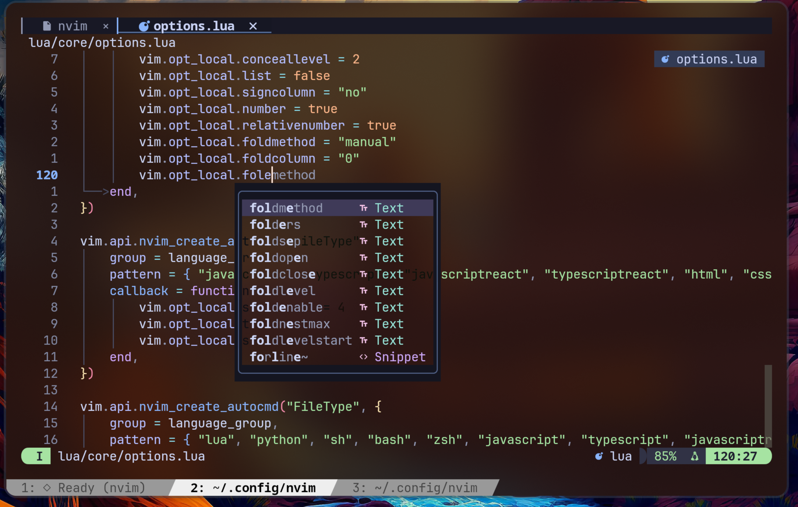
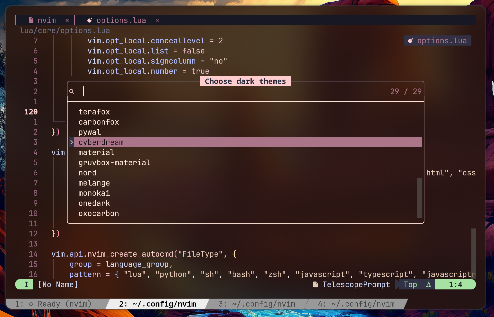

# ✦ Neovim configuration

Built to understand the editor, not just use it.

 

## Who built this

I'm Medhansh — 18, based in Chandigarh. I build from scratch before I reach for a framework.  
Not out of stubbornness. Because the day something breaks, you need to know what's underneath it.

This config is the same philosophy applied to my editor.

Most people inherit a Neovim config. Copy-paste from a Reddit thread, clone someone's dotfiles,  
run `:Lazy sync` and call it done. It works — until it doesn't. Then you're debugging someone  
else's abstractions with no idea what's underneath them.

I wanted to know what was underneath. So I built it myself.

Every plugin here has a reason. Every keybind was a decision. Nothing is in here because  
it came with a starter template.

If that sounds like how you think about software — this config might be useful to you.  
If you just want something that works out of the box, there are better options — [kickstart.nvim](https://github.com/nvim-lua/kickstart.nvim), [LazyVim](https://github.com/LazyVim/LazyVim), [AstroNvim](https://github.com/AstroNvim/AstroNvim).



## Table of Contents

- [Who built this](#who-built-this)
- [Requirements](#requirements)
- [Installation](#installation)
- [Aesthetics](#aesthetics)
- [Plugins](#plugins)
- [Keybinds](#keybinds)
- [Special thanks](#special-thanks)

## Requirements

This configuration is built for performance and deep tool integration. To ensure everything (including image rendering, Jupyter notebooks, formatting, and linting) works correctly, you must install the following dependencies.

### Minimum version
*   **Neovim v0.10.0** or newer is strictly required.
*   **Python 3.11+** is recommended for full Molten and plugin support.

### System packages

#### Arch Linux
```bash
sudo pacman -S --needed neovim git curl ripgrep fd tree-sitter-cli nodejs npm \
  base-devel unzip python python-pip xdg-utils wl-clipboard man-db lazygit \
  imagemagick kitty make shfmt
```
For the custom dashboard (AUR):
```bash
yay -S pokemon-colorscripts-git
```

#### Debian / Ubuntu
```bash
sudo apt update
sudo apt install -y neovim git curl ripgrep fd-find tree-sitter-cli nodejs npm \
  build-essential unzip python3 python3-venv python3-pip xdg-utils wl-clipboard \
  man-db lazygit imagemagick kitty make shfmt
```
*Note: Symlink `fdfind` to `fd` for Telescope compatibility:*
```bash
mkdir -p ~/.local/bin
ln -sf "$(command -v fdfind)" ~/.local/bin/fd
```

#### Fedora
```bash
sudo dnf install neovim git curl ripgrep fd-find tree-sitter-cli nodejs npm \
  development-tools unzip python3 python3-pip xdg-utils wl-clipboard \
  man-db lazygit imagemagick kitty make shfmt
```

#### macOS (Homebrew)
```bash
brew install neovim git ripgrep fd tree-sitter-cli node python lazygit \
  imagemagick make shfmt stylua
```

### Mandatory Python environment
The configuration uses a dedicated virtual environment for the Python provider and Jupyter (Molten) support. This prevents system-wide dependency conflicts.

```bash
# Create the venv
python -m venv ~/.venvs/neovim

# Install core dependencies
~/.venvs/neovim/bin/pip install --upgrade pip
~/.venvs/neovim/bin/pip install pynvim jupytext jupyter_client ipykernel nbformat
```

### Dashboard ASCII art
This config uses `pokemon-colorscripts` for the startup screen.
*   **Arch**: Install `pokemon-colorscripts-git` from AUR.
*   **Others**: Follow the installation guide at [phakt/pokemon-colorscripts](https://gitlab.com/phakt/pokemon-colorscripts).

### Recommended terminal
**Kitty** is highly recommended as it provides the most robust support for `image.nvim` and `molten-nvim` image rendering.


## Installation

1. Back up your existing Neovim configuration if you have one.
   ```bash
   mv ~/.config/nvim ~/.config/nvim.bak
   mv ~/.local/share/nvim ~/.local/share/nvim.bak
   ```
2. Clone this repository directly into your config directory.
   ```bash
   git clone https://github.com/medhansh/nvim-config ~/.config/nvim
   ```
3. Launch Neovim.
   ```bash
   nvim
   ```

On the first boot, `lazy.nvim` will automatically bootstrap itself, clone all configured plugins, and install essential Treesitter parsers and LSP servers. You will see a UI popup displaying the installation progress. Wait for it to finish before opening any source code files.

## Aesthetics

*   **Colorscheme**: Dynamically managed via a custom utility. Defaults to [TokyoNight](https://github.com/folke/tokyonight.nvim), but seamlessly supports Catppuccin, Rose Pine, Kanagawa, and Nightfox.
*   **Font**: [JetBrains Mono Nerd Font](https://www.nerdfonts.com/font-downloads), size 16 (configured via your terminal emulator).
*   **Transparency**: Editor chrome and floating windows are dynamically blended. You can toggle global background transparency on the fly using `<leader>uy`.
*   **Statusline**: Powered by `lualine.nvim` with a minimal, uncluttered design that integrates cleanly with the active colorscheme.



## Plugins

### Package management & core
| Plugin | Version | Purpose |
| :--- | :--- | :--- |
| [folke/lazy.nvim](https://github.com/folke/lazy.nvim) | `main` | Fast, feature-rich plugin manager |
| [folke/which-key.nvim](https://github.com/folke/which-key.nvim) | `main` | Displays a popup with possible key bindings |
| [nvim-lua/plenary.nvim](https://github.com/nvim-lua/plenary.nvim) | `master` | Core Lua functions used by many plugins |
| [MunifTanjim/nui.nvim](https://github.com/MunifTanjim/nui.nvim) | `main` | UI component library for Neovim |
| [nvim-tree/nvim-web-devicons](https://github.com/nvim-tree/nvim-web-devicons) | `master` | Standard file icons |
| [echasnovski/mini.icons](https://github.com/echasnovski/mini.icons) | `main` | Modern icon provider |

### LSP, completion & snippets
| Plugin | Version | Purpose |
| :--- | :--- | :--- |
| [neovim/nvim-lspconfig](https://github.com/neovim/nvim-lspconfig) | `master` | Quickstart configs for Nvim LSP |
| [mason-org/mason.nvim](https://github.com/mason-org/mason.nvim) | `main` | Portable package manager for LSPs, linters, and formatters |
| [mason-org/mason-lspconfig.nvim](https://github.com/mason-org/mason-lspconfig.nvim) | `main` | Bridges mason.nvim with lspconfig |
| [WhoIsSethDaniel/mason-tool-installer.nvim](https://github.com/WhoIsSethDaniel/mason-tool-installer.nvim) | `main` | Automatically installs 3rd party tools |
| [folke/lazydev.nvim](https://github.com/folke/lazydev.nvim) | `main` | Faster Lua LS setup for Neovim config |
| [b0o/schemastore.nvim](https://github.com/b0o/schemastore.nvim) | `main` | JSON/YAML schema validation |
| [hrsh7th/nvim-cmp](https://github.com/hrsh7th/nvim-cmp) | `main` | A completion engine plugin for neovim |
| [hrsh7th/cmp-nvim-lsp](https://github.com/hrsh7th/cmp-nvim-lsp) | `main` | LSP completion source |
| [hrsh7th/cmp-buffer](https://github.com/hrsh7th/cmp-buffer) | `main` | Buffer text completion source |
| [hrsh7th/cmp-path](https://github.com/hrsh7th/cmp-path) | `main` | File path completion source |
| [hrsh7th/cmp-nvim-lua](https://github.com/hrsh7th/cmp-nvim-lua) | `main` | Neovim Lua API completion source |
| [saadparwaiz1/cmp_luasnip](https://github.com/saadparwaiz1/cmp_luasnip) | `master` | LuaSnip completion source |
| [onsails/lspkind.nvim](https://github.com/onsails/lspkind.nvim) | `master` | VSCode-like pictograms for completion |
| [L3MON4D3/LuaSnip](https://github.com/L3MON4D3/LuaSnip) | `master` | Powerful snippet engine |
| [rafamadriz/friendly-snippets](https://github.com/rafamadriz/friendly-snippets) | `main` | Collection of standard snippets |
| [SmiteshP/nvim-navic](https://github.com/SmiteshP/nvim-navic) | `master` | LSP breadcrumbs |

### Editing, formatting & linting
| Plugin | Version | Purpose |
| :--- | :--- | :--- |
| [nvim-treesitter/nvim-treesitter](https://github.com/nvim-treesitter/nvim-treesitter) | `master` | Nvim Treesitter configurations and abstraction layer |
| [nvim-treesitter/nvim-treesitter-textobjects](https://github.com/nvim-treesitter/nvim-treesitter-textobjects) | `master` | Syntax aware text-objects |
| [windwp/nvim-ts-autotag](https://github.com/windwp/nvim-ts-autotag) | `main` | Use treesitter to auto close and auto rename html tags |
| [Wansmer/treesj](https://github.com/Wansmer/treesj) | `main` | Splitting/joining blocks of code |
| [stevearc/conform.nvim](https://github.com/stevearc/conform.nvim) | `master` | Lightweight yet powerful formatter setup |
| [mfussenegger/nvim-lint](https://github.com/mfussenegger/nvim-lint) | `master` | Asynchronous linter plugin |
| [windwp/nvim-autopairs](https://github.com/windwp/nvim-autopairs) | `master` | Autopairs for Neovim |
| [numToStr/Comment.nvim](https://github.com/numToStr/Comment.nvim) | `master` | Smart and powerful commenting plugin |
| [kylechui/nvim-surround](https://github.com/kylechui/nvim-surround) | `main` | Add/change/delete surrounding delimiter pairs |
| [jake-stewart/multicursor.nvim](https://github.com/jake-stewart/multicursor.nvim) | `main` | Advanced multicursor support |
| [smjonas/inc-rename.nvim](https://github.com/smjonas/inc-rename.nvim) | `main` | Incremental LSP renaming |
| [ThePrimeagen/refactoring.nvim](https://github.com/ThePrimeagen/refactoring.nvim) | `master` | Refactoring library based on the Refactoring book |
| [Pocco81/auto-save.nvim](https://github.com/Pocco81/auto-save.nvim) | `main` | Automatic file saving |

### Navigation & search
| Plugin | Version | Purpose |
| :--- | :--- | :--- |
| [nvim-telescope/telescope.nvim](https://github.com/nvim-telescope/telescope.nvim) | `0.1.x` | Highly extendable fuzzy finder over lists |
| [debugloop/telescope-undo.nvim](https://github.com/debugloop/telescope-undo.nvim) | `main` | Visual undo tree picker |
| [nvim-neo-tree/neo-tree.nvim](https://github.com/nvim-neo-tree/neo-tree.nvim) | `v3.x` | File system tree explorer |
| [ThePrimeagen/harpoon](https://github.com/ThePrimeagen/harpoon) | `master` | Lightning fast file navigation |
| [folke/flash.nvim](https://github.com/folke/flash.nvim) | `main` | Navigate your code with search labels |
| [MagicDuck/grug-far.nvim](https://github.com/MagicDuck/grug-far.nvim) | `main` | Find and replace in workspace |
| [stevearc/aerial.nvim](https://github.com/stevearc/aerial.nvim) | `master` | Code outline window |
| [folke/trouble.nvim](https://github.com/folke/trouble.nvim) | `main` | A pretty diagnostics, references, and telescope results list |
| [folke/todo-comments.nvim](https://github.com/folke/todo-comments.nvim) | `main` | Highlight, list and search todo comments in your projects |

### UI & visual enhancements
| Plugin | Version | Purpose |
| :--- | :--- | :--- |
| [nvim-lualine/lualine.nvim](https://github.com/nvim-lualine/lualine.nvim) | `master` | A blazing fast and easy to configure neovim statusline |
| [folke/noice.nvim](https://github.com/folke/noice.nvim) | `main` | Replaces the UI for messages, cmdline and the popupmenu |
| [rcarriga/nvim-notify](https://github.com/rcarriga/nvim-notify) | `master` | A fancy, configurable notification manager |
| [OXY2DEV/helpview.nvim](https://github.com/OXY2DEV/helpview.nvim) | `main` | A hackable & fancy vimdoc/help page viewer |
| [NvChad/nvim-colorizer.lua](https://github.com/NvChad/nvim-colorizer.lua) | `master` | High-performance color highlighter (supports ANSI codes) |
| [lukas-reineke/indent-blankline.nvim](https://github.com/lukas-reineke/indent-blankline.nvim) | `master` | Indent guides for Neovim |
| [kevinhwang91/nvim-ufo](https://github.com/kevinhwang91/nvim-ufo) | `main` | Ultra fold in Neovim |
| [kevinhwang91/promise-async](https://github.com/kevinhwang91/promise-async) | `main` | Promise & Async in Neovim (ufo dependency) |
| [folke/snacks.nvim](https://github.com/folke/snacks.nvim) | `main` | A collection of small QoL plugins (dashboard, bufdelete) |
| [karb94/neoscroll.nvim](https://github.com/karb94/neoscroll.nvim) | `master` | Smooth scrolling neovim plugin |
| [stevearc/dressing.nvim](https://github.com/stevearc/dressing.nvim) | `master` | Neovim plugin to improve the default vim.ui interfaces |
| [nvim-telescope/telescope-ui-select.nvim](https://github.com/nvim-telescope/telescope-ui-select.nvim) | `master` | Sets vim.ui.select to telescope |
| [b0o/incline.nvim](https://github.com/b0o/incline.nvim) | `main` | Floating statuslines for windows |
| [kevinhwang91/nvim-bqf](https://github.com/kevinhwang91/nvim-bqf) | `main` | Better quickfix window |
| [RRethy/vim-illuminate](https://github.com/RRethy/vim-illuminate) | `master` | Automatically highlighting other uses of the word under the cursor |
| [petertriho/nvim-scrollbar](https://github.com/petertriho/nvim-scrollbar) | `main` | Extensible Neovim Scrollbar |
| [kevinhwang91/nvim-hlslens](https://github.com/kevinhwang91/nvim-hlslens) | `main` | Hlsearch Lens for Neovim |
| [HiPhish/rainbow-delimiters.nvim](https://github.com/HiPhish/rainbow-delimiters.nvim) | `master` | Rainbow delimiters for Neovim |
| [sphamba/smear-cursor.nvim](https://github.com/sphamba/smear-cursor.nvim) | `main` | Smear cursor animation |
| [tzachar/highlight-undo.nvim](https://github.com/tzachar/highlight-undo.nvim) | `main` | Highlight changed text after Undo / Redo operations |
| [j-hui/fidget.nvim](https://github.com/j-hui/fidget.nvim) | `main` | Extensible UI for Neovim notifications and LSP progress |
| [romgrk/barbar.nvim](https://github.com/romgrk/barbar.nvim) | `master` | A tabline plugin for Neovim |

### Git
| Plugin | Version | Purpose |
| :--- | :--- | :--- |
| [lewis6991/gitsigns.nvim](https://github.com/lewis6991/gitsigns.nvim) | `main` | Super fast git decorations via extmarks |
| [NeogitOrg/neogit](https://github.com/NeogitOrg/neogit) | `master` | Magit clone for Neovim |

### Development & debugging
| Plugin | Version | Purpose |
| :--- | :--- | :--- |
| [mfussenegger/nvim-dap](https://github.com/mfussenegger/nvim-dap) | `master` | Debug Adapter Protocol client |
| [rcarriga/nvim-dap-ui](https://github.com/rcarriga/nvim-dap-ui) | `master` | A UI for nvim-dap |
| [nvim-neotest/nvim-nio](https://github.com/nvim-neotest/nvim-nio) | `master` | Asynchronous IO in Neovim |
| [theHamsta/nvim-dap-virtual-text](https://github.com/theHamsta/nvim-dap-virtual-text) | `master` | Virtual text for nvim-dap |
| [mfussenegger/nvim-dap-python](https://github.com/mfussenegger/nvim-dap-python) | `master` | nvim-dap extension for python |
| [mxsdev/nvim-dap-vscode-js](https://github.com/mxsdev/nvim-dap-vscode-js) | `main` | nvim-dap extension for vscode-js-debug |
| [nvim-neotest/neotest](https://github.com/nvim-neotest/neotest) | `master` | An extensible framework for interacting with tests |
| [nvim-neotest/neotest-plenary](https://github.com/nvim-neotest/neotest-plenary) | `master` | Plenary test runner for Neotest |
| [nvim-neotest/neotest-python](https://github.com/nvim-neotest/neotest-python) | `master` | Python test runner for Neotest |
| [haydenmeade/neotest-jest](https://github.com/haydenmeade/neotest-jest) | `main` | Jest test runner for Neotest |
| [alfaix/neotest-gtest](https://github.com/alfaix/neotest-gtest) | `main` | Google Test runner for Neotest |
| [CRAG666/code_runner.nvim](https://github.com/CRAG666/code_runner.nvim) | `main` | The best code runner you could have |
| [stevearc/overseer.nvim](https://github.com/stevearc/overseer.nvim) | `master` | A task runner and job management plugin |
| [akinsho/toggleterm.nvim](https://github.com/akinsho/toggleterm.nvim) | `main` | A neovim lua plugin to help easily manage multiple terminal windows |
| [rmagatti/auto-session](https://github.com/rmagatti/auto-session) | `main` | Automated session save and restore |

### Notes & markdown
| Plugin | Version | Purpose |
| :--- | :--- | :--- |
| [epwalsh/obsidian.nvim](https://github.com/epwalsh/obsidian.nvim) | `main` | Obsidian integration and note management |
| [MeanderingProgrammer/render-markdown.nvim](https://github.com/MeanderingProgrammer/render-markdown.nvim) | `main` | Plugin to improve viewing Markdown files |
| [iamcco/markdown-preview.nvim](https://github.com/iamcco/markdown-preview.nvim) | `master` | Markdown preview plugin for (neo)vim |
| [benlubas/molten-nvim](https://github.com/benlubas/molten-nvim) | `main` | An interactive REPL and notebook runner |
| [3rd/image.nvim](https://github.com/3rd/image.nvim) | `master` | Bringing images to Neovim |
| [folke/zen-mode.nvim](https://github.com/folke/zen-mode.nvim) | `main` | Distraction-free coding for Neovim |
| [folke/twilight.nvim](https://github.com/folke/twilight.nvim) | `main` | Dim unfocused text |
| [dkarter/bullets.vim](https://github.com/dkarter/bullets.vim) | `master` | Simple bullet lists |
| [gaoDean/autolist.nvim](https://github.com/gaoDean/autolist.nvim) | `main` | Automatic list continuation and formatting |

### Themes & colorschemes
| Plugin | Version | Purpose |
| :--- | :--- | :--- |
| [folke/tokyonight.nvim](https://github.com/folke/tokyonight.nvim) | `main` | A clean, dark Neovim theme |
| [catppuccin/nvim](https://github.com/catppuccin/nvim) | `main` | Soothing pastel theme for the high-spirited |
| [rebelot/kanagawa.nvim](https://github.com/rebelot/kanagawa.nvim) | `master` | NeoVim dark colorscheme inspired by the colors of the famous painting |
| [rose-pine/neovim](https://github.com/rose-pine/neovim) | `main` | All natural pine, faux fur and a bit of soho vibes |
| [EdenEast/nightfox.nvim](https://github.com/EdenEast/nightfox.nvim) | `main` | Highly customizable theme |
| [ellisonleao/gruvbox.nvim](https://github.com/ellisonleao/gruvbox.nvim) | `main` | Lua port of the most famous vim colorscheme |
| [Mofiqul/vscode.nvim](https://github.com/Mofiqul/vscode.nvim) | `main` | VSCode theme |
| [Mofiqul/dracula.nvim](https://github.com/Mofiqul/dracula.nvim) | `main` | Dracula colorscheme |
| [sainnhe/everforest](https://github.com/sainnhe/everforest) | `master` | Green based colorscheme |
| [scottmckendry/cyberdream.nvim](https://github.com/scottmckendry/cyberdream.nvim) | `main` | High-contrast, futuristic theme |
| [AlphaTechnolog/pywal.nvim](https://github.com/AlphaTechnolog/pywal.nvim) | `main` | Pywal theme |

## Keybinds

The leader key is set to `<Space>`.

Note: `<C-x>` refers to pressing `Control` and `x` simultaneously. `<M-x>` refers to the `Alt` (or Option) key. 

### Normal mode

#### Files, Buffers & Search
| Key | Action | Plugin/builtin |
| :--- | :--- | :--- |
| `<leader>e` | Open or close the file sidebar | Neo-tree |
| `<leader>fe` | Open the classic netrw file list | Builtin |
| `<leader>fs` | Save the current file | Builtin |
| `<leader>q` | Quit the current window | Builtin |
| `q` | Close buffer (in help/man pages) | Builtin |
| `<leader>bb` | Browse open buffers | Telescope |
| `<leader>bn` | Go to the next buffer | Builtin |
| `<leader>bp` | Go to the previous buffer | Builtin |
| `<leader>bd` | Delete the current buffer | snacks.nvim |
| `<leader>bo` | Delete every other buffer | Builtin |
| `<C-1>` to `<C-9>` | Go to buffer 1-9 | Builtin |
| `<leader>p` | Open the command palette | Telescope |
| `<leader>ff` | Find a file by name | Telescope |
| `<leader>fg` | Search for text in the project | Telescope |
| `<leader>f/` | Search in the current file | Telescope |
| `<leader>fb` | Switch between open files | Telescope |
| `<leader>fp` | Find a tracked project file | Telescope |
| `<leader>fr` | Reopen a recent file | Telescope |
| `<leader>fS` | Search symbols in this file | Telescope |
| `<leader>fw` | Search workspace symbols | Telescope |
| `<leader>ft` | Find every TODO, NOTE, or FIX comment | todo-comments.nvim |
| `<leader>fk` | Browse every keybinding | Custom / Telescope |
| `<leader>?` | Browse every keybinding | Custom / Telescope |
| `<leader>sr` | Search and replace across the project | grug-far.nvim |
| `<leader>sw` | Search for the word under the cursor across the project | grug-far.nvim |
| `<leader>sB` | Search and replace only in the current file | grug-far.nvim |
| `<leader>sj` | Jump (flash) | flash.nvim |
| `<leader>ss` | Treesitter jump (flash) | flash.nvim |
| `<leader>ha` | Add to harpoon | Harpoon |
| `<leader>hh` | Toggle harpoon menu | Harpoon |
| `<leader>h1` to `<leader>h4` | Harpoon file 1-4 | Harpoon |

#### LSP, Formatting & Diagnostics
| Key | Action | Plugin/builtin |
| :--- | :--- | :--- |
| `<leader>cf` | Format the current file | conform.nvim |
| `<leader>uf` | Toggle auto-format on save | conform.nvim |
| `<leader>ca` | Code actions | LSP |
| `<leader>rn` | Rename symbol (incremental preview) | inc-rename.nvim |
| `gd` | Go to definition | LSP |
| `gD` | Go to declaration | LSP |
| `gi` | Go to implementation | LSP |
| `gr` | Go to references | LSP |
| `K` | Hover documentation | LSP |
| `<leader>ld` | Explain problem (cursor) | LSP |
| `<leader>lD` | Jump to declaration | LSP |
| `<leader>le` | Explain problem (float) | LSP |
| `<leader>li` | Jump to implementation | LSP |
| `<leader>lI` | Toggle inlay hints | LSP |
| `<leader>lk` | Signature help | LSP |
| `<leader>lo` | Document symbols | LSP |
| `<leader>lR` | LSP Restart | LSP |
| `<leader>ls` | Workspace symbols | LSP |
| `<leader>lt` | Type definition | LSP |
| `[d` | Previous Diagnostic | Builtin |
| `]d` | Next Diagnostic | Builtin |
| `<leader>xd` | Buffer diagnostics | trouble.nvim |
| `<leader>xl` | Location list | trouble.nvim |
| `<leader>xo` | Document symbols side | trouble.nvim |
| `<leader>xq` | Quickfix list | trouble.nvim |
| `<leader>xx` | Project diagnostics | trouble.nvim |

#### Git Operations
| Key | Action | Plugin/builtin |
| :--- | :--- | :--- |
| `]h` | Next hunk (motion) | gitsigns.nvim |
| `[h` | Previous hunk (motion) | gitsigns.nvim |
| `<leader>gn` | Next hunk (explicit) | gitsigns.nvim |
| `<leader>gp` | Previous hunk (explicit) | gitsigns.nvim |
| `<leader>gs` | Stage this changed block | gitsigns.nvim |
| `<leader>gu` | Undo staging for this changed block | gitsigns.nvim |
| `<leader>gr` | Discard this changed block | gitsigns.nvim |
| `<leader>gb` | Show who changed this line and when | gitsigns.nvim |
| `<leader>gd` | Preview this changed block | gitsigns.nvim |
| `<leader>gD` | Compare this file against git | gitsigns.nvim |
| `<leader>gg` | Open the full git panel | Neogit |
| `<leader>gc` | Start a git commit | Neogit |

#### Terminal, Tasks & Debugging
| Key | Action | Plugin/builtin |
| :--- | :--- | :--- |
| `<leader>rr` | Run the current file | code_runner.nvim |
| `<leader>to` | Open or close the floating terminal | toggleterm.nvim |
| `<leader>tf` | Open the main project shell | toggleterm.nvim |
| `<leader>th` | Open a bottom terminal panel | toggleterm.nvim |
| `<leader>tv` | Open a side terminal panel | toggleterm.nvim |
| `<leader>tg` | Pick from active terminal sessions | toggleterm.nvim |
| `<leader>ta` | Task quick action | overseer.nvim |
| `<leader>tl` | Load task bundle | overseer.nvim |
| `<leader>tr` | Run task | overseer.nvim |
| `<leader>tt` | Toggle task list | overseer.nvim |
| `<leader>db` | Toggle breakpoint | nvim-dap |
| `<leader>dc` | Continue | nvim-dap |
| `<leader>di` | Step into | nvim-dap |
| `<leader>do` | Step over | nvim-dap |
| `<leader>dO` | Step out | nvim-dap |
| `<leader>dr` | Toggle REPL | nvim-dap |
| `<leader>dt` | Terminate | nvim-dap |
| `<leader>du` | Toggle UI | nvim-dap-ui |

#### Notes & Markdown
| Key | Action | Plugin/builtin |
| :--- | :--- | :--- |
| `<leader>zz` | Focus on writing or reading without distractions | zen-mode.nvim |
| `<leader>zw` | Toggle low-noise writing mode for this buffer | Custom utils |
| `<leader>zb` | Toggle Brainstorm mode (Universal) | Custom utils |
| `<leader>nt` | Dim unfocused text around the cursor | twilight.nvim |
| `<leader>ns` | Strikeout the word under the cursor | Builtin |
| `<leader>np` | Open or close the markdown browser preview | markdown-preview.nvim |
| `<leader>nB` | Markdown: Brainstorm Mode | Custom utils |
| `<leader>nP` | Markdown: Professional Mode | Custom utils |
| `<leader>no` | Open the document or code outline | aerial.nvim |
| `<leader>nn` | Open outline navigation in a floating picker | aerial.nvim |
| `<leader>os` | Obsidian: Search notes | obsidian.nvim |
| `<leader>of` | Obsidian: Find notes | obsidian.nvim |
| `<leader>on` | Obsidian: New note | obsidian.nvim |
| `<leader>ot` | Obsidian: Today's daily note | obsidian.nvim |
| `<leader>oy` | Obsidian: Yesterday's daily note | obsidian.nvim |
| `<leader>ob` | Obsidian: Show backlinks | obsidian.nvim |
| `<leader>ol` | Obsidian: Show links in current note | obsidian.nvim |
| `<leader>oi` | Obsidian: Paste image from clipboard | obsidian.nvim |
| `<leader>ch` | Toggle checkbox (Obsidian) | obsidian.nvim |
| `<leader>mi` | Initialize Molten and pick a kernel | molten-nvim |
| `<leader>me` | Evaluate an operator selection | molten-nvim |
| `<leader>ml` | Evaluate the current line | molten-nvim |
| `<leader>md` | Delete the current Molten cell | molten-nvim |
| `<leader>mh` | Hide Molten output | molten-nvim |
| `<leader>ms` | Show Molten output | molten-nvim |
| `<leader>mr` | Restart the active Molten kernel | molten-nvim |
| `<leader>mo` | Open the current Molten output in a browser | molten-nvim |

#### Folds
| Key | Action | Plugin/builtin |
| :--- | :--- | :--- |
| `<leader>fo` | Open the fold under the cursor completely | Builtin |
| `<leader>fc` | Close the fold under the cursor completely | Builtin |
| `<leader>fa` | Toggle the fold under the cursor | Builtin |
| `<leader>fv` | Preview folded lines under the cursor | nvim-ufo |
| `<leader>fR` | Open every fold in the file | nvim-ufo |
| `<leader>fM` | Close every fold in the file | nvim-ufo |
| `<leader>za` | Toggle fold | Builtin |
| `<leader>zc` | Close fold | Builtin |
| `<leader>zM` | Close all folds | Builtin |
| `<leader>zo` | Open fold | Builtin |
| `<leader>zR` | Open all folds | Builtin |
| `<leader>zv` | Preview fold | Builtin |

#### UI Toggles & Window Management
| Key | Action | Plugin/builtin |
| :--- | :--- | :--- |
| `<leader>hvt` | Toggle Helpview | helpview.nvim |
| `<leader>hvs` | Toggle Helpview Split | helpview.nvim |
| `<leader>hvr` | Refresh Helpview | helpview.nvim |
| `<leader>ut` | Choose a theme | Custom theme utility |
| `<leader>un` | Switch to the next theme | Custom theme utility |
| `<leader>up` | Switch to the previous theme | Custom theme utility |
| `<leader>us` | Toggle spell check | Builtin |
| `<leader>uy` | Turn transparency on or off | Custom theme utility |
| `<leader>ua` | Turn autosave on or off (global) | auto-save.nvim |
| `<leader>ub` | Turn autosave on or off for this file | auto-save.nvim |
| `<leader>uw` | Toggle text wrapping | Builtin |
| `<leader>wv` | Split the window vertically | Builtin |
| `<leader>wh` | Split the window horizontally | Builtin |
| `<leader>wc` | Close the current window | Builtin |
| `<leader>wo` | Keep only the current window | Builtin |
| `<leader>wr` | Restore session | auto-session |
| `<leader>ws` | Save session | auto-session |

#### Multicursor
| Key | Action | Plugin/builtin |
| :--- | :--- | :--- |
| `<leader>Ma` | Add the next matching cursor | multicursor.nvim |
| `<leader>MA` | Add cursors for every match in the file | multicursor.nvim |
| `<leader>Ms` | Skip the next matching cursor | multicursor.nvim |
| `<leader>Mv` | Restore the last cleared multicursor set | multicursor.nvim |
| `<leader>Mx` | Delete current multicursor | multicursor.nvim |
| `<leader>Mt` | Toggle multicursor for current match | multicursor.nvim |
| `<leader>Mj` | Add cursor below | multicursor.nvim |
| `<leader>Mk` | Add cursor above | multicursor.nvim |
| `<leader>MJ` | Skip cursor below | multicursor.nvim |
| `<leader>MK` | Skip cursor above | multicursor.nvim |
| `<C-M-Up>` | Add cursor above | multicursor.nvim |
| `<C-M-Down>` | Add cursor below | multicursor.nvim |

### Insert mode
| Key | Action | Plugin/builtin |
| :--- | :--- | :--- |
| `<C-Space>` | Trigger autocomplete | nvim-cmp |
| `<C-e>` | Abort autocomplete | nvim-cmp |
| `<CR>` | Confirm completion selection | nvim-cmp |
| `<C-\>` | Toggle terminal | toggleterm.nvim |

### Visual mode
| Key | Action | Plugin/builtin |
| :--- | :--- | :--- |
| `<leader>ns` | Strikeout the selection | Builtin |
| `<leader>ca` | Range code action | LSP |
| `<leader>sr` | Search and replace within selection | grug-far.nvim |
| `<leader>on` | Obsidian: Link selection to new note | obsidian.nvim |
| `<leader>ol` | Obsidian: Link selection to existing note | obsidian.nvim |
| `<leader>mv` | Evaluate the visual selection | molten-nvim |
| `<leader>Mj` | Add cursor below | multicursor.nvim |
| `<leader>Mk` | Add cursor above | multicursor.nvim |
| `<leader>MJ` | Skip cursor below | multicursor.nvim |
| `<leader>MK` | Skip cursor above | multicursor.nvim |
| `<C-M-Up>` | Add cursor above | multicursor.nvim |
| `<C-M-Down>` | Add cursor below | multicursor.nvim |
| `J` | Move selected block down | Builtin |
| `K` | Move selected block up | Builtin |

### Terminal mode
| Key | Action | Plugin/builtin |
| :--- | :--- | :--- |
| `<C-\>` | Toggle terminal window | toggleterm.nvim |
| `<C-\><C-n>` | Exit terminal insert mode | Builtin |

## Special thanks

* [LazyVim](https://github.com/LazyVim/LazyVim) - For setting the modern standard of how a modular Neovim configuration should be structured.
* [NvChad](https://github.com/NvChad/NvChad) - For endless inspiration on UI aesthetics and dynamic themes.

Contributions, tweaks, and suggestions are welcome via pull requests.