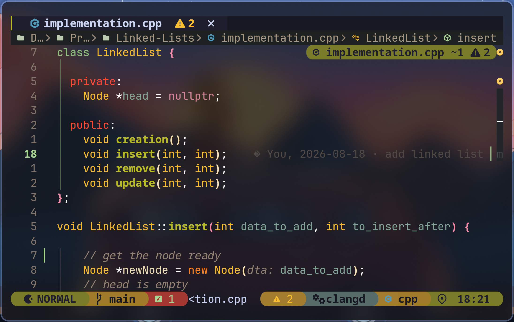
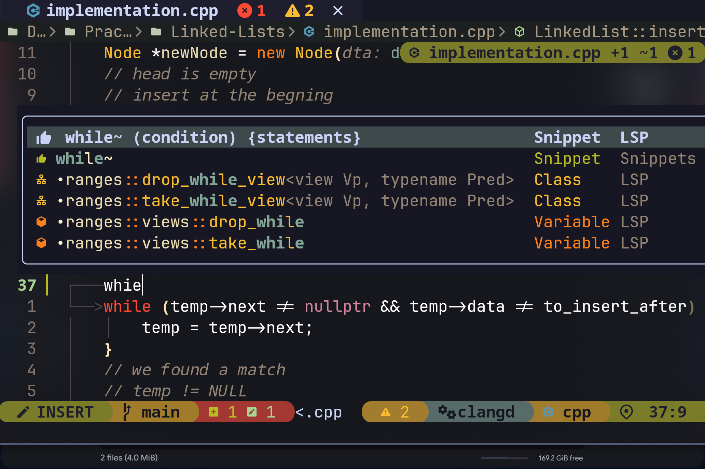
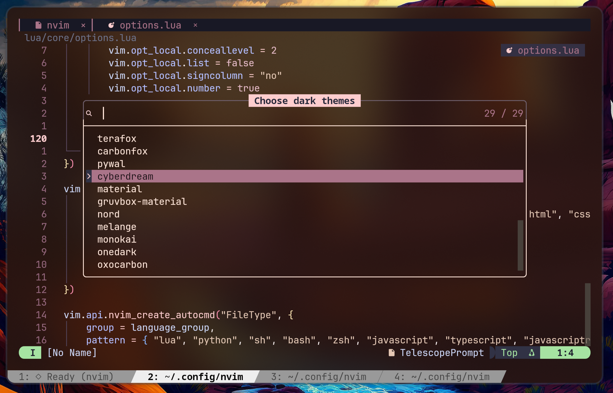

# ✦ Neovim Configuration

Built to understand the editor, not just use it. Engineered for embedded hardware, high-performance C/C++, full-stack web, Jupyter data science, and distraction-free writing.

   

<p align="center">
  
</p>

---

## Table of Contents

- [Highlights & Superpowers](#-highlights--superpowers)
- [Who Built This](#who-built-this)
- [Project Structure](#project-structure)
- [Requirements](#requirements)
- [Installation](#installation)
  - [🪟 Windows Setup Guide (windows.md)](windows.md)
- [Aesthetics](#aesthetics)
- [Plugins](#plugins)
  - [Package Management & Core](#package-management--core)
  - [LSP, Completion & Diagnostics](#lsp-completion--diagnostics)
  - [Editing, Formatting & Linting](#editing-formatting--linting)
  - [Navigation & Search](#navigation--search)
  - [UI & Visual Polish](#ui--visual-polish)
  - [Git](#git)
  - [Development, Embedded & Debugging](#development-embedded--debugging)
  - [AI Assistants](#ai-assistants)
  - [Notes, Markdown & Jupyter](#notes-markdown--jupyter)
  - [Terminal & Session](#terminal--session)
  - [Colorschemes](#colorschemes)
- [Keybinds](#keybinds)
  - [Files, Search & Pickers](#files-search--pickers-snackspicker)
  - [Code Navigation, LSP & Refactoring](#code-navigation-lsp--refactoring)
  - [Code Folding](#code-folding-nvim-ufo)
  - [Git & Conflict Resolution](#git--conflict-resolution)
  - [Terminal & Code Runner](#terminal--code-runner)
  - [UI & System Toggle Hub](#distro-grade-ui--system-toggle-hub-leaderu)
  - [AI Coding & Chat](#ai-coding--chat)
  - [Markdown, Notes & Writing](#markdown-notes--writing)
  - [Obsidian](#obsidian)
  - [Development, Embedded & Tasks](#development-embedded--tasks)
  - [CMake & Build System](#cmake--build-system)
  - [Database Browser & SQL (Dadbod)](#database-browser--sql-dadbod)
  - [Yanky & Clipboard History](#yanky--clipboard-history)
  - [Multicursor](#multicursor)
  - [Windows & Sessions](#windows--sessions)
- [Multi-Device Updating](#multi-device-updating)
- [Special Thanks](#special-thanks)

---

## 🌟 Highlights & Superpowers

<p align="center">
  
</p>

- **⚡ Ultra-Fast Cold Starts (~38ms)**: Aggressive bytecode caching, lazy loading, and lightweight pure Lua modules.
- **🔍 Instant Search & Multi-Modal Pickers**: **`snacks.picker`** with image thumbnails, hidden dotfile search, and git status.
- **🛡️ Interactive Diagnostic Callout Cards**: **`tiny-inline-diagnostic.nvim`** renders compiler-style curved callouts (`╭─`, `╰─`) directly under code errors.
- **🤖 Multi-File Aware AI Agents**: **`CopilotChat.nvim`** + **`supermaven`** equipped with workspace read tools (`glob`, `grep`, `file`, `gitdiff`) and 1-key floating prompt modal (`<leader>cp`).
- **🔬 Embedded & Zephyr RTOS Automation**: **`overseer.nvim`** templates for `west build`, `west flash --erase`, `west debug`, and bare-metal ARM GDB DAP debugging (`arm-none-eabi-gdb`).
- **📊 Jupyter Data Science & REPL**: Cell-by-cell notebook execution with **`molten-nvim`**, inline image rendering, and **`vim-slime`**.
- **📝 Obsidian & Markdown Studio**: Inline rendered callouts, Unicode tables, auto bullet lists, and live auto-sync preview (`<leader>np`).
- **🎛️ Unified Distro-Grade `<leader>u` Hub**: Single-key toggles for diagnostics, inlay hints, line numbers, conceal, wrap, spellcheck, image hover, and transparency.
- **🖥️ Integrated Terminal Manager**: **`toggleterm.nvim`** with floating, horizontal, and vertical layouts, plus 1-key code execution via **`code_runner.nvim`**.
- **💾 Automatic Session Restore**: **`auto-session`** saves and restores workspace sessions per directory.
- **🎨 20+ Colorschemes with Dynamic Theming**: **Matugen** wallpaper accent extraction, 1-key theme cycling (`<leader>un` / `<leader>up`), and transparency toggle.
- **🔄 Automatic 1-Key Multi-Device Sync**: Press **`<leader>uu`** (or `:ConfigUpdate`) to pull and sync the config across any machine.

---

## Who Built This

I'm Medhansh — 18, based in Chandigarh. I build from scratch before I reach for a framework.
Not out of stubbornness. Because the day something breaks, you need to know what's underneath it.

This config is the same philosophy applied to my editor.

Every plugin here has a reason. Every keybind was a decision. Nothing is in here because
it came with a starter template.

If that sounds like how you think about software — this config might be useful to you.
If you just want something that works out of the box, there are better options — [kickstart.nvim](https://github.com/nvim-lua/kickstart.nvim), [LazyVim](https://github.com/LazyVim/LazyVim), [AstroNvim](https://github.com/AstroNvim/AstroNvim).

---

## Project Structure

```
~/.config/nvim/
├── init.lua                    # Entry point — leader, providers, loaders
├── lua/
│   ├── core/
│   │   ├── options.lua         # Editor options (tabs, scroll, clipboard, etc.)
│   │   ├── keymaps.lua         # Global keybindings
│   │   ├── autocmds.lua        # Autocommands (format-on-save, yank highlight, etc.)
│   │   └── lazy.lua            # lazy.nvim bootstrap & plugin loader
│   ├── plugins/                # 70 plugin config files (one per plugin/group)
│   │   ├── lsp.lua             # LSP client setup
│   │   ├── cmp.lua             # Completion engine
│   │   ├── snacks.lua          # Snacks picker, explorer, dashboard, zen
│   │   ├── copilot.lua         # AI assistants (Copilot, CopilotChat, Supermaven)
│   │   ├── treesitter.lua      # Syntax parsing & highlighting
│   │   ├── zephyr.lua          # Zephyr RTOS overseer templates
│   │   ├── dap.lua             # Debug Adapter Protocol
│   │   ├── molten.lua          # Jupyter notebook integration
│   │   └── ...                 # Every other plugin
│   ├── lsp/
│   │   └── servers.lua         # Per-server LSP configurations
│   ├── utils/
│   │   ├── theme.lua           # Dynamic theme engine (Matugen, 20+ schemes)
│   │   ├── updater.lua         # 1-key config sync across machines
│   │   ├── terminal_style.lua  # Terminal layout manager
│   │   ├── markdown_modes.lua  # Writing mode presets
│   │   └── writing.lua         # Writing utilities
│   └── snippets/               # Custom snippet definitions
├── ftdetect/                   # Custom filetype detection
├── ftplugin/                   # Per-filetype settings
├── disabled_plugins/           # Archived / disabled plugin configs
└── assets/                     # README screenshots
```

---

## Requirements

### Minimum Version

- **Neovim v0.10.0+** (v0.11+ / v0.12+ recommended).
- **Python 3.11+** for Molten Jupyter notebook sync and Python provider.
- **Node.js & npm** for GitHub Copilot and plugin build scripts.

> **Note**: Language servers (LSPs), formatters, linters, and debug adapters are managed and installed **automatically on first launch** via Mason and Treesitter. You only need to install the host system packages below.

### System Packages

#### Arch Linux

```bash
sudo pacman -S --needed \
  neovim git ripgrep fd nodejs npm python python-pip gcc make unzip imagemagick wl-clipboard
```
*(Replace `wl-clipboard` with `xclip` if running on X11 instead of Wayland).*

#### Debian / Ubuntu

```bash
sudo apt update
sudo apt install -y \
  neovim git ripgrep fd-find nodejs npm python3 python3-venv python3-pip build-essential unzip imagemagick wl-clipboard
```

#### Fedora

```bash
sudo dnf install -y \
  neovim git ripgrep fd-find nodejs npm python3 python3-pip gcc make unzip ImageMagick wl-clipboard
```

#### macOS (Homebrew)

```bash
brew install neovim git ripgrep fd node python make imagemagick
```

#### Windows (winget)

```powershell
winget install Neovim.Neovim Git.Git BurntSushi.ripgrep.MSVC sharkdp.fd `
  OpenJS.NodeJS.LTS Python.Python.3.12 LLVM.LLVM JesseDuffield.lazygit 7zip.7zip `
  Microsoft.WindowsTerminal NerdFonts.JetBrainsMono -e
```
*(See [windows.md](windows.md) for full Windows Terminal configs, Nerd Fonts, and `Ctrl+G` setup)*

### Dedicated Python Environment

The configuration uses a dedicated virtual environment for the Python provider and Jupyter (Molten) notebook execution:

#### Linux / macOS

```bash
python3 -m venv ~/.venvs/neovim
~/.venvs/neovim/bin/pip install --upgrade pip
~/.venvs/neovim/bin/pip install pynvim jupytext jupyter_client ipykernel nbformat cairosvg pnglatex plotly pyperclip
```

#### Windows (PowerShell)

```powershell
python -m venv "$HOME\.venvs\neovim"
& "$HOME\.venvs\neovim\Scripts\pip.exe" install --upgrade pip
& "$HOME\.venvs\neovim\Scripts\pip.exe" install pynvim jupytext jupyter_client `
  ipykernel nbformat cairosvg pnglatex plotly pyperclip
```

### Optional Tools

Install these only if you need their specific workflows:

| Tool | Used By | Purpose | Installation |
| :--- | :--- | :--- | :--- |
| `lazygit` | snacks.lazygit | Floating Git TUI modal (`<leader>gl`) | `pacman -S lazygit` / `brew install lazygit` |
| `cmake` + `ninja` | cmake-tools.nvim | C/C++ CMake build generation & debugging | `pacman -S cmake ninja` |
| `git-delta` | tiny-code-action.nvim | Enhanced side-by-side diff in code actions | `pacman -S git-delta` |
| `live-server` | live-server.nvim | Hot-reload web dev server (`<leader>lv`) | `npm install -g live-server` |
| `west` | zephyr.lua | Embedded Zephyr RTOS building & flashing | `pip install west` (inside python venv) |
| `arm-none-eabi-gdb` | nvim-dap | Bare-metal ARM Cortex MCU debugging | ARM GNU toolchain |
| `zen-browser` | markdown-preview | Live Markdown & HTML preview browser | [zen-browser.app](https://zen-browser.app) |

### Recommended Terminal

- **Linux / macOS**: **Kitty** or **WezTerm** — native support for the Kitty Graphics Protocol used by `snacks.image` and `molten-nvim` for floating in-terminal image rendering.
- **Windows**: **WezTerm** or **Windows Terminal**.

---

## Installation

### Linux / macOS

1. Back up your existing Neovim configuration:
    ```bash
    mv ~/.config/nvim ~/.config/nvim.bak
    mv ~/.local/share/nvim ~/.local/share/nvim.bak
    ```
2. Clone this repository:
    ```bash
    git clone https://github.com/codebyneeraj/nvim-config.git ~/.config/nvim
    ```
3. Create the dedicated Python virtual environment:
    ```bash
    python3 -m venv ~/.venvs/neovim
    ~/.venvs/neovim/bin/pip install --upgrade pip
    ~/.venvs/neovim/bin/pip install pynvim jupytext jupyter_client ipykernel nbformat cairosvg pnglatex plotly pyperclip
    ```
4. Launch Neovim:
    ```bash
    nvim
    ```

### Windows (PowerShell)

> [!TIP]
> For a full Windows guide with aesthetic Windows Terminal configs, `Ctrl+G` quick-launch shortcuts, and troubleshooting common path/symlink issues, see the dedicated [🪟 Windows Setup Guide (windows.md)](windows.md).

1. Back up your existing Neovim configuration:
    ```powershell
    Rename-Item -Path "$env:LOCALAPPDATA\nvim" -NewName "nvim.bak" -ErrorAction SilentlyContinue
    Rename-Item -Path "$env:LOCALAPPDATA\nvim-data" -NewName "nvim-data.bak" -ErrorAction SilentlyContinue
    ```
2. Clone this repository directly into your Windows Neovim directory:
    ```powershell
    git clone https://github.com/codebyneeraj/nvim-config.git "$env:LOCALAPPDATA\nvim"
    ```
3. Create the dedicated Python virtual environment (for Python LSP, Molten, and DAP support):
    ```powershell
    python -m venv "$HOME\.venvs\neovim"
    & "$HOME\.venvs\neovim\Scripts\pip.exe" install --upgrade pip
    & "$HOME\.venvs\neovim\Scripts\pip.exe" install pynvim jupytext jupyter_client ipykernel nbformat cairosvg pnglatex plotly pyperclip
    ```
4. Launch Neovim:
    ```powershell
    nvim
    ```

On first launch, `lazy.nvim` will automatically bootstrap itself, clone all plugins, compile treesitter parsers, and Mason will install configured language servers and tools. Verify your installation inside Neovim with `:checkhealth`.

---

## Aesthetics

<p align="center">
  
</p>

- **Colorscheme**: Dynamically managed via a custom theme engine in `lua/utils/theme.lua`. Supports **Matugen** dynamic wallpaper accent extraction plus 20+ bundled schemes (see [Colorschemes](#colorschemes)).
- **Font**: [JetBrains Mono Nerd Font](https://www.nerdfonts.com/font-downloads), size 16.
- **Top Tabline**: `barbar.nvim` with smooth pill separators, file icons, and diagnostic badges.
- **Breadcrumbs**: `dropbar.nvim` for clickable LSP symbol breadcrumbs in the winbar.
- **Bottom Statusline**: `lualine.nvim` with solid opaque sections and rounded pill geometry (`` / ``).
- **Floating Filename**: `incline.nvim` renders the active filename floating over each split.
- **Fluid Motion**: `smear-cursor.nvim` for smooth cursor trail animations, `cinnamon.nvim` for smooth scrolling.
- **Yank & Paste Flash**: `tiny-glimmer.nvim` highlights yanked and pasted regions with a flash animation.
- **Delimiters**: `rainbow-delimiters.nvim` for colorful nested brackets and scopes.
- **Window Separators**: `colorful-winsep.nvim` for vibrant active window borders.
- **Scrollbar**: `satellite.nvim` for a diagnostic-aware scrollbar.
- **Transparency**: Toggle global glass transparency on the fly using `<leader>uy`.

---

## Plugins

### Package Management & Core

| Plugin | Purpose |
| :--- | :--- |
| [folke/lazy.nvim](https://github.com/folke/lazy.nvim) | Fast, feature-rich plugin manager with bytecode caching |
| [folke/snacks.nvim](https://github.com/folke/snacks.nvim) | High-performance picker, explorer, dashboard, zen mode, scratchpad, dimming, smooth scroll, lazygit, git blame, terminal, image preview |
| [folke/which-key.nvim](https://github.com/folke/which-key.nvim) | Interactive keybinding discovery menu |
| [nvim-lua/plenary.nvim](https://github.com/nvim-lua/plenary.nvim) | Core Lua utility functions |
| [nvim-tree/nvim-web-devicons](https://github.com/nvim-tree/nvim-web-devicons) | Standard Nerd Font file icons |
| [echasnovski/mini.icons](https://github.com/echasnovski/mini.icons) | Lightweight icon provider |

### LSP, Completion & Diagnostics

| Plugin | Purpose |
| :--- | :--- |
| [neovim/nvim-lspconfig](https://github.com/neovim/nvim-lspconfig) | Preconfigured language server configurations |
| [mason-org/mason.nvim](https://github.com/mason-org/mason.nvim) | Portable package manager for LSPs, linters, and formatters |
| [mason-org/mason-lspconfig.nvim](https://github.com/mason-org/mason-lspconfig.nvim) | Bridges mason.nvim with lspconfig |
| [WhoIsSethDaniel/mason-tool-installer.nvim](https://github.com/WhoIsSethDaniel/mason-tool-installer.nvim) | Automatically ensures all tools are installed |
| [folke/lazydev.nvim](https://github.com/folke/lazydev.nvim) | Full type signatures and autocompletion for Neovim Lua APIs |
| [b0o/schemastore.nvim](https://github.com/b0o/schemastore.nvim) | JSON/YAML schema validation catalog |
| [hrsh7th/nvim-cmp](https://github.com/hrsh7th/nvim-cmp) | Completion engine with LSP, buffer, path, and snippet sources |
| [saghen/blink.cmp](https://github.com/saghen/blink.cmp) | High-performance alternative completion engine |
| [L3MON4D3/LuaSnip](https://github.com/L3MON4D3/LuaSnip) | Extensible snippet engine |
| [rafamadriz/friendly-snippets](https://github.com/rafamadriz/friendly-snippets) | Comprehensive community snippet collection |
| [rachartier/tiny-inline-diagnostic.nvim](https://github.com/rachartier/tiny-inline-diagnostic.nvim) | Modern compiler-style curved diagnostic callouts |
| [dnlhc/glance.nvim](https://github.com/dnlhc/glance.nvim) | VS Code-style peek definition, references, and implementations |
| [Bekaboo/dropbar.nvim](https://github.com/Bekaboo/dropbar.nvim) | Clickable LSP symbol breadcrumb bar |
| [b0o/incline.nvim](https://github.com/b0o/incline.nvim) | Floating filename indicator per window |

### Editing, Formatting & Linting

| Plugin | Purpose |
| :--- | :--- |
| [nvim-treesitter/nvim-treesitter](https://github.com/nvim-treesitter/nvim-treesitter) | Syntax parsing and highlighting |
| [nvim-treesitter/nvim-treesitter-context](https://github.com/nvim-treesitter/nvim-treesitter-context) | Sticky function/struct context header at top of buffer |
| [nvim-treesitter/nvim-treesitter-textobjects](https://github.com/nvim-treesitter/nvim-treesitter-textobjects) | Treesitter-aware functions, classes, and parameter textobjects |
| [windwp/nvim-ts-autotag](https://github.com/windwp/nvim-ts-autotag) | Auto close and rename HTML/JSX tags |
| [folke/ts-comments.nvim](https://github.com/folke/ts-comments.nvim) | Treesitter-aware commenting |
| [Wansmer/treesj](https://github.com/Wansmer/treesj) | Split and join code blocks |
| [stevearc/conform.nvim](https://github.com/stevearc/conform.nvim) | High-speed asynchronous formatter engine |
| [mfussenegger/nvim-lint](https://github.com/mfussenegger/nvim-lint) | Asynchronous linter engine |
| [windwp/nvim-autopairs](https://github.com/windwp/nvim-autopairs) | Auto-close brackets and quotes |
| [kylechui/nvim-surround](https://github.com/kylechui/nvim-surround) | Add, change, and delete surrounding delimiters (`ys`, `cs`, `ds`) |
| [jake-stewart/multicursor.nvim](https://github.com/jake-stewart/multicursor.nvim) | True multiple cursors with mouse and keyboard bindings |
| [smjonas/inc-rename.nvim](https://github.com/smjonas/inc-rename.nvim) | Live incremental symbol renaming |
| [ThePrimeagen/refactoring.nvim](https://github.com/ThePrimeagen/refactoring.nvim) | Extract function, extract variable, and code refactoring |
| [echasnovski/mini.ai](https://github.com/echasnovski/mini.ai) | Extended text objects for functions, classes, and tags |
| [gbprod/yanky.nvim](https://github.com/gbprod/yanky.nvim) | Improved yank and put with cycle history ring |
| [okuuva/auto-save.nvim](https://github.com/okuuva/auto-save.nvim) | Automatic buffer saving |
| [rachartier/tiny-glimmer.nvim](https://github.com/rachartier/tiny-glimmer.nvim) | Animated flash highlight on yank and paste |

### Navigation & Search

| Plugin | Purpose |
| :--- | :--- |
| [folke/snacks.nvim](https://github.com/folke/snacks.nvim) (`picker`) | Ultra-fast fuzzy finder for files, buffers, grep, git, and symbols |
| [ThePrimeagen/harpoon](https://github.com/ThePrimeagen/harpoon) | Lightning-fast file pinning and switching |
| [folke/flash.nvim](https://github.com/folke/flash.nvim) | 2D motion navigation with 2-character search labels |
| [MagicDuck/grug-far.nvim](https://github.com/MagicDuck/grug-far.nvim) | Project-wide find and replace |
| [stevearc/aerial.nvim](https://github.com/stevearc/aerial.nvim) | Live code outline sidebar |
| [folke/trouble.nvim](https://github.com/folke/trouble.nvim) | Diagnostics, references, and results list |
| [folke/todo-comments.nvim](https://github.com/folke/todo-comments.nvim) | Highlight and search `TODO`, `NOTE`, `FIX`, `PERF` comments |
| [stevearc/oil.nvim](https://github.com/stevearc/oil.nvim) | Edit your filesystem like a standard text buffer (`-`) |
| [mbbill/undotree](https://github.com/mbbill/undotree) | Visual undo history graph |

### UI & Visual Polish

| Plugin | Purpose |
| :--- | :--- |
| [nvim-lualine/lualine.nvim](https://github.com/nvim-lualine/lualine.nvim) | Solid opaque statusline with rounded pill caps (`` / ``) |
| [romgrk/barbar.nvim](https://github.com/romgrk/barbar.nvim) | Sleek buffer tabline with close glyphs and diagnostic counters |
| [folke/noice.nvim](https://github.com/folke/noice.nvim) | Modern cmdline popup, floating notifications, and doc borders |
| [sphamba/smear-cursor.nvim](https://github.com/sphamba/smear-cursor.nvim) | Fluid cursor trail animation |
| [declancm/cinnamon.nvim](https://github.com/declancm/cinnamon.nvim) | Smooth animated scrolling |
| [HiPhish/rainbow-delimiters.nvim](https://github.com/HiPhish/rainbow-delimiters.nvim) | Vibrant rainbow-colored matching brackets |
| [NvChad/nvim-colorizer.lua](https://github.com/NvChad/nvim-colorizer.lua) | Virtual text color swatches (`██`) without background clutter |
| [kevinhwang91/nvim-ufo](https://github.com/kevinhwang91/nvim-ufo) | Ultra fold preview and provider |
| [RRethy/vim-illuminate](https://github.com/RRethy/vim-illuminate) | Highlight other uses of the word under cursor |
| [j-hui/fidget.nvim](https://github.com/j-hui/fidget.nvim) | Non-intrusive LSP progress spinner |
| [m4xshen/smartcolumn.nvim](https://github.com/m4xshen/smartcolumn.nvim) | Smart color column that only appears past 80/100 chars |
| [stevearc/quicker.nvim](https://github.com/stevearc/quicker.nvim) | Quickfix list enhancements with inline editing |
| [kevinhwang91/nvim-bqf](https://github.com/kevinhwang91/nvim-bqf) | Better quickfix window with preview and fuzzy search |
| [rachartier/tiny-code-action.nvim](https://github.com/rachartier/tiny-code-action.nvim) | Code actions menu with live diff preview |
| [lewis6991/satellite.nvim](https://github.com/lewis6991/satellite.nvim) | Diagnostic-aware scrollbar |
| [nvim-zh/colorful-winsep.nvim](https://github.com/nvim-zh/colorful-winsep.nvim) | Vibrant active window separator |
| [gorbit99/codewindow.nvim](https://github.com/gorbit99/codewindow.nvim) | Code minimap sidebar |
| [OXY2DEV/helpview.nvim](https://github.com/OXY2DEV/helpview.nvim) | Enhanced help file viewer with rich rendering |
| [mrjones2014/smart-splits.nvim](https://github.com/mrjones2014/smart-splits.nvim) | Seamless window resizing and navigation across splits |

### Git

| Plugin | Purpose |
| :--- | :--- |
| [lewis6991/gitsigns.nvim](https://github.com/lewis6991/gitsigns.nvim) | Inline git blame, gutter diff signs, hunk staging |
| [NeogitOrg/neogit](https://github.com/NeogitOrg/neogit) | Magit-like full Git management panel |
| [sindrets/diffview.nvim](https://github.com/sindrets/diffview.nvim) | Interactive side-by-side diff and merge viewer |
| [FabijanZulj/blame.nvim](https://github.com/FabijanZulj/blame.nvim) | Full-file git blame viewer |
| [akinsho/git-conflict.nvim](https://github.com/akinsho/git-conflict.nvim) | Highlight and resolve git conflict markers |
| [folke/snacks.nvim](https://github.com/folke/snacks.nvim) (`lazygit`) | Floating Lazygit terminal panel (`<leader>gl`) |

### Development, Embedded & Debugging

| Plugin | Purpose |
| :--- | :--- |
| [mfussenegger/nvim-dap](https://github.com/mfussenegger/nvim-dap) | Debug Adapter Protocol client with embedded GDB support |
| [rcarriga/nvim-dap-ui](https://github.com/rcarriga/nvim-dap-ui) | Full visual debugger layout (scopes, breakpoints, stacks, watches) |
| [theHamsta/nvim-dap-virtual-text](https://github.com/theHamsta/nvim-dap-virtual-text) | Live variable values rendered as virtual text |
| [mfussenegger/nvim-dap-python](https://github.com/mfussenegger/nvim-dap-python) | Python debugger adapter |
| [nvim-neotest/neotest](https://github.com/nvim-neotest/neotest) | Test runner with Python, Plenary, Jest, and GTest adapters |
| [stevearc/overseer.nvim](https://github.com/stevearc/overseer.nvim) | Task runner with **Zephyr RTOS** `west build`, `west flash --erase`, and `west debug` |
| [Civitasv/cmake-tools.nvim](https://github.com/Civitasv/cmake-tools.nvim) | CMake configure, build, and run integration |
| [p00f/clangd_extensions.nvim](https://github.com/p00f/clangd_extensions.nvim) | Clangd AST hierarchy, type formatting, and inlay hints |
| [linux-cultist/venv-selector.nvim](https://github.com/linux-cultist/venv-selector.nvim) | Auto-detect and switch Python virtual environments |
| [kristijanhusak/vim-dadbod-ui](https://github.com/kristijanhusak/vim-dadbod-ui) | Database browser and interactive SQL editor |
| [barrett-ruth/live-server.nvim](https://github.com/barrett-ruth/live-server.nvim) | Live web development server |
| [jpalardy/vim-slime](https://github.com/jpalardy/vim-slime) | Seamless line and selection REPL sender |
| [CRAG666/code_runner.nvim](https://github.com/CRAG666/code_runner.nvim) | Quick code execution for single files |
| [luckasRanarison/tailwind-tools.nvim](https://github.com/luckasRanarison/tailwind-tools.nvim) | Tailwind CSS class sorting, preview, and completion |

### AI Assistants

| Plugin | Purpose |
| :--- | :--- |
| [zbirenbaum/copilot.lua](https://github.com/zbirenbaum/copilot.lua) | GitHub Copilot inline ghost text completion |
| [CopilotC-Nvim/CopilotChat.nvim](https://github.com/CopilotC-Nvim/CopilotChat.nvim) | Multi-file aware Copilot Chat with workspace tools (`glob`, `grep`, `file`) |
| [supermaven-inc/supermaven-nvim](https://github.com/supermaven-inc/supermaven-nvim) | Ultra-fast Supermaven inline AI completion |
| [olimorris/codecompanion.nvim](https://github.com/olimorris/codecompanion.nvim) | AI inline assistant and prompt actions |

### Notes, Markdown & Jupyter

| Plugin | Purpose |
| :--- | :--- |
| [MeanderingProgrammer/render-markdown.nvim](https://github.com/MeanderingProgrammer/render-markdown.nvim) | Rich in-buffer rendered headings, callouts, checkboxes, and pipe tables |
| [epwalsh/obsidian.nvim](https://github.com/epwalsh/obsidian.nvim) | Obsidian vault integration, wikilinks, daily notes, and tags |
| [ice345/markdown-table-wrap.nvim](https://github.com/ice345/markdown-table-wrap.nvim) | Formatted markdown table viewer and wrapping |
| [iamcco/markdown-preview.nvim](https://github.com/iamcco/markdown-preview.nvim) | Live auto-sync browser preview (`<leader>np`) |
| [benlubas/molten-nvim](https://github.com/benlubas/molten-nvim) | Interactive Jupyter REPL and notebook runner |
| [gaoDean/autolist.nvim](https://github.com/gaoDean/autolist.nvim) | Automatic bullet list continuation and smart renumbering |
| [folke/twilight.nvim](https://github.com/folke/twilight.nvim) | Dim unfocused code for distraction-free focus |
| [HakonHarnes/img-clip.nvim](https://github.com/HakonHarnes/img-clip.nvim) | Paste images from clipboard into markdown |
| [3rd/image.nvim](https://github.com/3rd/image.nvim) | In-terminal image rendering |

### Terminal & Session

| Plugin | Purpose |
| :--- | :--- |
| [akinsho/toggleterm.nvim](https://github.com/akinsho/toggleterm.nvim) | Terminal manager with floating, horizontal, and vertical layouts |
| [rmagatti/auto-session](https://github.com/rmagatti/auto-session) | Automatic workspace session save and restore |
| [mikesmithgh/kitty-scrollback.nvim](https://github.com/mikesmithgh/kitty-scrollback.nvim) | Browse Kitty terminal scrollback buffer in Neovim |

### Colorschemes

All managed by the dynamic theme engine in `lua/utils/theme.lua`. Cycle with `<leader>un` / `<leader>up` or pick with `<leader>ut`.

| Scheme | Scheme | Scheme | Scheme |
| :--- | :--- | :--- | :--- |
| TokyoNight | Catppuccin | Rosé Pine | Kanagawa |
| Nightfox | Gruvbox | Gruvbox Material | VS Code |
| Dracula | Everforest | Cyberdream | Material |
| Melange | Monokai | Nord | OneDarkPro |
| Oxocarbon | Pywal / Matugen | | |

---

## Keybinds

The leader key is set to `<Space>`.

### Files, Search & Pickers (`Snacks.picker`)

| Key | Action | Engine |
| :--- | :--- | :--- |
| `<leader><space>` | Smart Find Files | snacks.picker |
| `<leader>e` | Open Project File Explorer | snacks.explorer |
| `-` | Edit filesystem as text buffer | oil.nvim |
| `<leader>ff` | Find files by name | snacks.picker |
| `<leader>fg` | Live grep workspace text | snacks.picker |
| `<leader>fr` | Browse recent files | snacks.picker |
| `<leader>f/` | Fuzzy search lines in current buffer | snacks.picker |
| `<leader>fb` / `<leader>bb` | Browse open buffers | snacks.picker |
| `<leader>bd` | Delete current buffer cleanly | snacks.bufdelete |
| `<leader>bo` | Close all other buffers | barbar.nvim |
| `<leader>bn` / `<S-l>` | Next buffer | barbar.nvim |
| `<leader>bp` / `<S-h>` | Previous buffer | barbar.nvim |
| `<leader>fp` | Find tracked project files | snacks.picker |
| `<leader>fS` / `<leader>lo` | Document symbols outline | snacks.picker |
| `<leader>fw` / `<leader>ls` | Workspace symbols search | snacks.picker |
| `<leader>fu` | Visual undo history | snacks.picker |
| `<leader>ft` | Find TODO / NOTE / FIX comments | todo-comments |
| `<leader>p` | Command palette | snacks.picker |
| `<leader>?` / `<leader>fk` | Interactive keymap finder | snacks.picker |
| `<leader>sr` | Project-wide find and replace | grug-far |
| `<leader>sw` | Search word under cursor (replace) | grug-far |
| `<leader>sB` | Search & replace in current file | grug-far |
| `<leader>si` | Browse workspace images (floating preview) | snacks.picker |
| `<leader>sj` | Jump anywhere on screen | flash.nvim |
| `<leader>ss` | Jump by syntax block (treesitter) | flash.nvim |
| `<leader>fs` | Save current file | builtin |
| `<leader>q` | Quit current window | builtin |
| `<leader>.` | Toggle scratch buffer | snacks.scratch |
| `<leader>S` | Select scratch buffer | snacks.scratch |
| `<leader>cR` | Rename file (LSP-aware) | snacks.rename |
| `]r` / `[r` | Next / previous LSP word reference | snacks.words |
| `<leader>ha` | Harpoon: add file | harpoon |
| `<leader>hh` | Harpoon: toggle menu | harpoon |
| `<leader>h1`–`<leader>h4` | Harpoon: jump to file 1–4 | harpoon |

### Code Navigation, LSP & Refactoring

| Key | Action | Engine |
| :--- | :--- | :--- |
| `gd` | Go to definition | LSP |
| `gD` | Go to declaration | LSP |
| `gi` | Go to implementation | LSP |
| `gr` | List references | LSP |
| `K` | Hover documentation | LSP |
| `gpd` | **Peek Definition** in float overlay | glance.nvim |
| `gpr` | **Peek References** in float overlay | glance.nvim |
| `gpi` | **Peek Implementations** in float overlay | glance.nvim |
| `gpt` | **Peek Type Definitions** in float overlay | glance.nvim |
| `<leader>ca` | Code actions with live diff preview | tiny-code-action |
| `<leader>cf` | Format current file | conform.nvim |
| `<leader>rn` | Rename symbol everywhere | Built-in LSP |
| `<leader>ce` | Extract function (visual) | refactoring.nvim |
| `<leader>cv` | Extract variable (visual) | refactoring.nvim |
| `<leader>ci` | Inline variable | refactoring.nvim |
| `[d` / `]d` | Jump to previous / next diagnostic | Built-in Diagnostic |
| `<leader>xx` | Diagnostics list (Workspace) | trouble.nvim |
| `<leader>xd` | Diagnostics list (Current Buffer) | trouble.nvim |
| `<leader>no` | Toggle code outline sidebar | aerial.nvim |
| `<leader>nn` | Toggle floating outline navigator | aerial.nvim |

### Code Folding (`nvim-ufo`)

| Key | Action |
| :--- | :--- |
| `<leader>fo` | Open fold under cursor completely |
| `<leader>fc` | Close fold under cursor completely |
| `<leader>fa` | Toggle fold under cursor |
| `<leader>fv` | Preview folded lines |
| `<leader>fR` | Open all folds in file |
| `<leader>fM` | Close all folds in file |

### Git & Conflict Resolution

| Key | Action | Engine |
| :--- | :--- | :--- |
| `]h` / `[h` | Jump to next / previous hunk | gitsigns |
| `<leader>gn` / `<leader>gp` | Jump to next / previous hunk | gitsigns |
| `<leader>gs` | Stage current hunk | gitsigns |
| `<leader>gu` | Undo staging for hunk | gitsigns |
| `<leader>gr` | Discard / reset hunk | gitsigns |
| `<leader>gb` | Line git blame | gitsigns |
| `<leader>gd` | Preview hunk diff | gitsigns |
| `<leader>gD` | Diff buffer against git index | gitsigns |
| `<leader>gh` | Current file commit history | diffview.nvim |
| `<leader>gq` | Close diffview | diffview.nvim |
| `<leader>gg` | Open full Neogit panel | neogit |
| `<leader>gc` | Start Neogit commit | neogit |
| `<leader>gl` | Open floating Lazygit | snacks.lazygit |
| `<leader>gf` | Lazygit current file history | snacks.lazygit |
| `<leader>gB` | Open git permalink in browser | snacks.gitbrowse |
| `<leader>gco` | **Conflict: Choose Ours** | git-conflict |
| `<leader>gct` | **Conflict: Choose Theirs** | git-conflict |
| `<leader>gcb` | **Conflict: Choose Both** | git-conflict |
| `<leader>gc0` | **Conflict: Choose None** | git-conflict |
| `<leader>gc]` / `<leader>gc[` | Next / previous conflict marker | git-conflict |
| `<leader>gcq` | Send all conflicts to Quickfix list | git-conflict |
| `]t` / `[t` | Next / previous TODO comment | todo-comments |

### Terminal & Code Runner

| Key | Action | Engine |
| :--- | :--- | :--- |
| `` <C-`> `` / `<leader>to` | Toggle active terminal | toggleterm |
| `<leader>tf` | Open main project shell (floating) | toggleterm |
| `<leader>th` | Open bottom terminal panel | toggleterm |
| `<leader>tv` | Open side terminal panel | toggleterm |
| `<leader>tg` | Pick from active terminal sessions | toggleterm |
| `<leader>ts` / `<leader>tS` | Choose terminal layout style | terminal_style |
| `<leader>rr` | **Run code selection / block** | code_runner |
| `<leader>rf` | **Run current file** | code_runner |
| `<leader>rp` | **Run project** | code_runner |
| `<leader>rc` | **Close runner window** | code_runner |
| `<Esc><Esc>` | Exit terminal mode | Built-in |

### Distro-Grade UI & System Toggle Hub (`<leader>u...`)

| Key | Action | Visual Status |
| :--- | :--- | :--- |
| **`<leader>uu`** | **Update Neovim Config (Git Pull & Sync)** | ` Synced commits` |
| **`<leader>ud`** | **Toggle LSP Diagnostics** | `󰒕 ON` / `󰂭 OFF` |
| **`<leader>uh`** | **Toggle LSP Inlay Hints** | `󰌵 ON` / `󰂭 OFF` |
| **`<leader>ul`** | **Toggle Relative Line Numbers** | Absolute / Relative |
| **`<leader>uc`** | **Toggle Conceal Level** | Level 0 / 2 |
| **`<leader>ux`** | **Toggle Treesitter Sticky Context** | Header on/off |
| **`<leader>ui`** | **Toggle Hovering Image Previews** | `󰋩 ON` / `󰂭 OFF` |
| **`<leader>us`** | **Toggle Spellcheck** | Spell on/off |
| **`<leader>uw`** | **Toggle Word Wrap** | Wrap on/off |
| **`<leader>ua`** | **Toggle Auto-Save (Global)** | Auto-save on/off |
| **`<leader>ub`** | **Toggle Auto-Save (Buffer)** | Buffer auto-save |
| **`<leader>uy`** | **Toggle Background Transparency** | Opaque / Glass |
| **`<leader>uf`** | **Toggle Auto-Format on Save** | Format on/off |
| **`<leader>um`** | **Toggle Buffer Modifiable** | Locked / Unlocked |
| **`<leader>ut`** | **Choose Theme** | Theme picker |
| **`<leader>un`** | **Next Theme** | Theme cycle |
| **`<leader>up`** | **Previous Theme** | Theme cycle |
| **`<leader>uS`** | **Choose Statusline Style** | Style picker |
| **`<leader>uT`** | **Choose Terminal Layout** | Layout picker |
| **`<leader>uC`** | **Toggle Copilot AI Engine** | Copilot on/off |
| **`<leader>uz`** | **Toggle Zen Mode** | Zen on/off |

### AI Coding & Chat

| Key | Action | Engine |
| :--- | :--- | :--- |
| `<leader>Cq` | **Floating Ask Copilot Prompt Box** | CopilotChat |
| `<leader>Cc` | Toggle Copilot Chat Window | CopilotChat |
| `<leader>Ce` | Copilot Explain Code (normal / visual) | CopilotChat |
| `<leader>Cf` | Copilot Fix Bug (normal / visual) | CopilotChat |
| `<leader>Cr` | Copilot Review Code (normal / visual) | CopilotChat |
| `<leader>Co` | Copilot Optimize Code (normal / visual) | CopilotChat |
| `<leader>Cn` | Copilot Study Notes (normal / visual) | CopilotChat |
| `<leader>Ct` | Copilot Generate Unit Tests | CopilotChat |
| `<leader>CD` | Copilot Write Documentation | CopilotChat |
| `<leader>Cg` | Copilot Generate Commit Message | CopilotChat |
| `<leader>CR` | Copilot Reset Chat History | CopilotChat |
| `<leader>CM` | Switch Copilot Model | CopilotChat |
| `<leader>Cp` | Copilot Open Panel | copilot.lua |
| `<leader>Cs` | Copilot Status | copilot.lua |
| `<leader>Cd` / `<leader>Cx` | Copilot Toggle Engine | copilot.lua |
| `<leader>Ca` | Copilot Authenticate | copilot.lua |
| `<M-a>` | **Toggle Supermaven AI Autocomplete** | supermaven-nvim |
| `<leader>ac` | **Toggle CodeCompanion AI Chat** | codecompanion.nvim |
| `<leader>aa` | **CodeCompanion AI Actions** | codecompanion.nvim |
| `<M-w>` (insert) | Accept Copilot word | copilot.lua |
| `<M-l>` (insert) | Accept Copilot line | copilot.lua |
| `<M-]>` / `<M-[>` (insert) | Next / previous suggestion | copilot.lua |

### Markdown, Notes & Writing

| Key | Action | Engine |
| :--- | :--- | :--- |
| `<leader>np` | **Markdown Preview (Auto-Sync Browser)** | markdown-preview |
| `<leader>z` / `<leader>zz` | **Toggle Zen Focus Mode** | snacks.zen |
| `<leader>zw` | Toggle Low-Noise Writing Mode | custom |
| `<leader>zb` / `<leader>nB` | Toggle Brainstorm Mode | markdown_modes |
| `<leader>nP` | Toggle Professional Mode | markdown_modes |
| `<leader>nr` | Fix / recalculate markdown list numbering | autolist.nvim |
| `<leader>nt` | Dim unfocused text | twilight.nvim |
| `<leader>ns` | Strikeout text (`~~...~~`) | custom |
| `<leader>nd` | Dismiss all notifications | snacks.notifier |
| `<leader>nh` | Show notification history | snacks.notifier |
| `<leader>ih` | Hover preview image under cursor | snacks.image |
| `<leader>mTi` | Toggle markdown table inline view | markdown-table-wrap |
| `<leader>mTr` | Toggle markdown table reader view | markdown-table-wrap |

### Obsidian

| Key | Action | Engine |
| :--- | :--- | :--- |
| `<leader>on` | New note | obsidian.nvim |
| `<leader>of` | Find notes | obsidian.nvim |
| `<leader>ot` | Daily note | obsidian.nvim |
| `<leader>ob` | Show backlinks | obsidian.nvim |
| `<leader>os` | Search notes | obsidian.nvim |
| `<leader>oy` | Yesterday's daily note | obsidian.nvim |
| `<leader>ol` | Show links in note | obsidian.nvim |
| `<leader>oi` | Paste image from clipboard | obsidian.nvim |

### Development, Embedded & Tasks

| Key | Action | Engine |
| :--- | :--- | :--- |
| `<leader>lv` | **Start Live Web Server** | live-server.nvim |
| `<leader>lV` | Stop Live Web Server | live-server.nvim |
| `<leader>tr` | Run task (**Zephyr `west build`, `west flash`**) | overseer.nvim |
| `<leader>tt` | Toggle task list panel | overseer.nvim |
| `<leader>db` / `<F9>` | Toggle breakpoint | nvim-dap |
| `<F5>` / `<leader>dc` | Start / Continue Debugging | nvim-dap |
| `<S-F5>` / `<leader>dt` | Terminate Debugging Session | nvim-dap |
| `<F10>` / `<leader>do` | Debug: Step Over | nvim-dap |
| `<F11>` / `<leader>di` | Debug: Step Into | nvim-dap |
| `<F12>` / `<leader>dO` | Debug: Step Out | nvim-dap |
| `<leader>dr` | Toggle Debug REPL Console | nvim-dap |
| `<leader>du` | Toggle DAP Debugger UI | nvim-dap-ui |
| `<leader>Tnr` | Run nearest unit test | neotest |
| `<leader>Tnf` | Run current test file | neotest |
| `<leader>rs` | Send selection to REPL | vim-slime |
| `<leader>rl` | Send line to REPL | vim-slime |
| `<leader>mi` | Initialize Molten Jupyter kernel | molten-nvim |
| `<leader>me` | Evaluate Molten cell operator | molten-nvim |
| `<leader>ml` | Evaluate Molten line | molten-nvim |
| `<leader>mv` | Evaluate visual selection | molten-nvim |
| `<leader>md` | Delete current Molten cell | molten-nvim |
| `<leader>mh` | Hide Molten output | molten-nvim |
| `<leader>ms` | Show Molten output | molten-nvim |
| `<leader>mr` | Restart active kernel | molten-nvim |
| `<leader>mo` | Open output in browser | molten-nvim |

### CMake & Build System

| Key | Action | Engine |
| :--- | :--- | :--- |
| `<leader>Bg` | **CMake: Generate build system** | cmake-tools |
| `<leader>Bb` | **CMake: Build project** | cmake-tools |
| `<leader>Br` | **CMake: Run target** | cmake-tools |
| `<leader>Bd` | **CMake: Debug target** | cmake-tools |
| `<leader>Bt` | **CMake: Select build target** | cmake-tools |

### Database Browser & SQL (Dadbod)

| Key | Action | Engine |
| :--- | :--- | :--- |
| `<leader>Db` | **Toggle Database UI (Sidebar)** | vim-dadbod-ui |
| `<leader>Df` | Find database buffer | vim-dadbod-ui |
| `<leader>Dr` | Rename database buffer | vim-dadbod-ui |
| `<leader>Dl` | Show last query info | vim-dadbod-ui |

### Yanky & Clipboard History

| Key | Action | Engine |
| :--- | :--- | :--- |
| `<leader>yy` | Yank text into ring history (normal / visual) | yanky.nvim |
| `<leader>yp` | Put yanked text after cursor | yanky.nvim |
| `<leader>yP` | Put yanked text before cursor | yanky.nvim |
| `<leader>fy` | Browse yank ring history in picker | yanky.nvim |
| `[y` / `<M-p>` | Cycle backward through yank history | yanky.nvim |
| `]y` / `<M-n>` | Cycle forward through yank history | yanky.nvim |

### Multicursor

| Key | Action |
| :--- | :--- |
| `<leader>Ma` | Add next matching cursor |
| `<leader>MA` | Add cursors for all matches |
| `<leader>Ms` | Skip next matching cursor |
| `<leader>Mv` | Restore cleared multicursors |
| `<leader>Mx` | Delete current cursor |
| `<leader>Mt` | Toggle cursor for match |
| `<leader>Mj` / `<leader>Mk` | Add cursor below / above |
| `<leader>MJ` / `<leader>MK` | Skip cursor below / above |
| `<C-M-Up>` / `<C-M-Down>` | Add cursor above / below |
| `<M-LeftMouse>` | Toggle cursor at mouse position |

### Windows & Sessions

| Key | Action | Engine |
| :--- | :--- | :--- |
| `<leader>wm` / `<C-w>z` | Maximize / zoom window | snacks.zen |
| `<leader>w=` / `<C-w>=` | Equalize window sizes | builtin |
| `<leader>wh` | Split horizontal | builtin |
| `<leader>wv` | Split vertical | builtin |
| `<leader>wc` | Close current window | builtin |
| `<leader>wo` | Close all other windows | builtin |
| `<leader>ws` | Save current workspace session | auto-session |
| `<leader>wr` | Restore saved workspace session | auto-session |
| `<leader>wl` | Search & switch workspace sessions | auto-session |

---

## Multi-Device Updating

If you run this configuration across multiple machines:

1. Open Neovim.
2. Press **`<leader>uu`** (or execute **`:ConfigUpdate`**).
3. Neovim will pull the latest changes, report synced commits, and automatically run `Lazy sync` in the background.

---

## Special Thanks

- [LazyVim](https://github.com/LazyVim/LazyVim) & [folke](https://github.com/folke) — For `snacks.nvim`, `lazy.nvim`, `flash.nvim`, and setting the modern Neovim standard.
- [NvChad](https://github.com/NvChad/NvChad) — For colorizer and dynamic aesthetic inspiration.
- [AstroNvim](https://github.com/AstroNvim/AstroNvim) — For UI toggle concepts.
